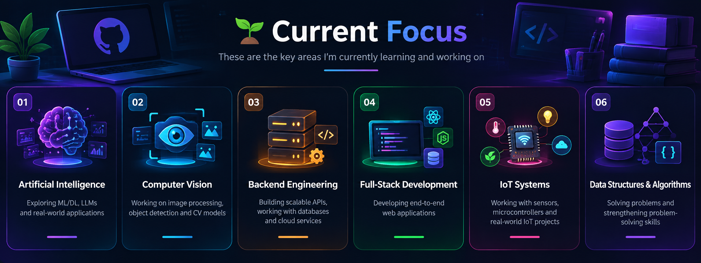

<!-- ========================= -->

<!--        HERO SECTION       -->

<!-- ========================= -->

<div align="center">


# 👋 Hey, I'm Raman Vhantale

### `Computer Engineering Student` • `AI/ML Enthusiast` • `Backend Developer`


<br/>

<a href="https://github.com/ramanvhantale">

</a>
<a href="https://www.linkedin.com/in/raman-vhantale-802b28373/">

</a>
<a href="mailto:raman.vhantale24@vit.edu">

</a>

<br/><br/>


</div>

---

## 🧑‍💻 About Me

I'm a Computer Engineering student at **Vishwakarma Institute of Technology, Pune**, interested in building intelligent and practical software systems.

My main areas of interest include **Artificial Intelligence, Machine Learning, Computer Vision, Backend Development, and IoT**.

I enjoy working across the complete development cycle — from building ML models and REST APIs to developing frontend interfaces and connecting software with embedded hardware.

<div align="center">

<!-- REPLACE the src below with your own About Me GIF URL -->


<br/><br/>


<br/><br/>


</div>

---

## 🚀 What I Work With

### 💻 Programming Languages

<p align="left">

</p>

### 🧠 AI / ML

<p align="left">

</p>

`Machine Learning` • `Computer Vision` • `MobileNetV2` • `Random Forest`

### ⚙️ Backend & APIs

<p align="left">

</p>

`REST APIs` • `JWT Authentication` • `Middleware` • `API Development`

### 🌐 Frontend

<p align="left">

</p>

### 🗄️ Databases

<p align="left">

</p>

### 🛠️ Tools

<p align="left">

</p>

### 🔌 IoT & Embedded

`ESP32` • `ESP32-CAM` • `SCT-013` • `ZMPT101B` • `IoT Sensors`

<!-- ADD the skills from your screenshot here, for example:
### ➕ More Skills

<p align="left">

</p>
-->

---

# 🚀 Featured Projects

<table>
<thead>
<tr>
<th width="20%">Project</th>
<th width="30%">Description</th>
<th width="22%">Tech Stack</th>
<th width="18%">Highlights</th>
<th width="10%">Repository</th>
</tr>
</thead>
<tbody>
<tr>
<td valign="top">

**🍎 FreshAI**<br/>Food Freshness & Shelf-Life Prediction<br/><sub>Dec 2025 – Mar 2026</sub>

</td>
<td valign="top">AI-powered food quality and shelf-life prediction system combining <b>Machine Learning, Computer Vision and IoT</b>.</td>
<td valign="top">


</td>
<td valign="top">
🤖 Freshness detection<br/>
🧠 MobileNetV2 classification<br/>
📊 Random Forest shelf-life<br/>
⚡ FastAPI + ⚛️ React<br/>
📷 ESP32-CAM + 🌡️ sensors
</td>
<td valign="top"><a href="https://github.com/ramanvhantale/FreshAI">FreshAI</a></td>
</tr>
<tr>
<td valign="top">

**🗺️ VoyageEdu**<br/>Campus Discovery Platform<br/><sub>Aug 2025 – Nov 2025</sub>

</td>
<td valign="top">Full-stack platform to help users discover educational institutions through interactive maps and location-based search.</td>
<td valign="top">


</td>
<td valign="top">
🏫 Institution discovery<br/>
📍 Location-based search<br/>
🗺️ Interactive maps<br/>
🔐 User authentication<br/>
⚙️ REST API + 🗄️ MongoDB
</td>
<td valign="top"><sub>Coming soon</sub><!-- Add: <a href="https://github.com/ramanvhantale/REPO_NAME">REPO_NAME</a> --></td>
</tr>
<tr>
<td valign="top">

**⚡ Smart Electric Meter**<br/>Energy Monitoring<br/><sub>Dec 2024 – Mar 2025</sub>

</td>
<td valign="top">IoT-based energy monitoring system for real-time measurement and visualization of electrical consumption.</td>
<td valign="top">


</td>
<td valign="top">
⚡ Real-time voltage<br/>
🔌 Current measurement<br/>
📊 Power & energy<br/>
☁️ Cloud transmission<br/>
📈 Live dashboard
</td>
<td valign="top"><sub>Coming soon</sub><!-- Add: <a href="https://github.com/ramanvhantale/REPO_NAME">REPO_NAME</a> --></td>
</tr>
</tbody>
</table>

<div align="center">

<a href="https://github.com/ramanvhantale/FreshAI"></a>
<a href="https://github.com/ramanvhantale/senate-nav-spark"></a>
<a href="https://github.com/ramanvhantale/html-portfolio"></a>

</div>

---

# 🧠 Core Computer Science

```text
Data Structures & Algorithms
Object-Oriented Programming
Database Management Systems
Operating Systems
REST API Development
Authentication & Authorization
Software Development
```

---

# 📊 GitHub Statistics

<div align="center">





</div>
---

# 🔥 Contribution Streak

<div align="center">


</div>

---


# 📈 Contribution Activity

<div align="center">

<picture>
  <source
    media="(prefers-color-scheme: dark)"
    srcset="https://raw.githubusercontent.com/ramanvhantale/ramanvhantale/output/pacman-contribution-graph-dark.svg"
  />

  <source
    media="(prefers-color-scheme: light)"
    srcset="https://raw.githubusercontent.com/ramanvhantale/ramanvhantale/output/pacman-contribution-graph.svg"
  />

  
</picture>

</div>

---

# 🧩 GitHub Profile Summary

<div align="center">


</div>

---


# 🌱 Current Focus

<div align="center">



</div>

---

# 🤝 Let's Connect

<div align="center">

<a href="https://github.com/ramanvhantale">

</a>

<a href="https://www.linkedin.com/in/raman-vhantale-802b28373/">

</a>

<a>
  
</a>

<a>
  
</a>

</div>

---

<div align="center">

### 💭 *"Build things that solve real problems."*


<br/><br/>

**Thanks for visiting my profile! ⭐**


</div>

